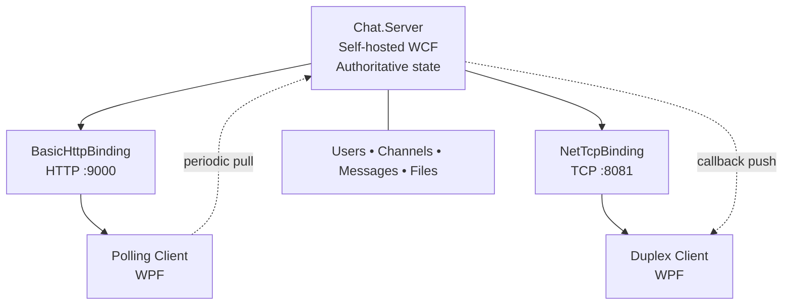
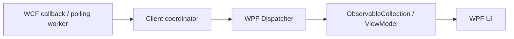

# Distributed Real-Time Chat Application

> Educational distributed chat application built with **C#**, **.NET Framework 4.8**, **WCF**, and **WPF**, implementing both HTTP polling and `NetTcpBinding` duplex push communication.

## Assignment at a glance

The application combines one authoritative WCF server with two independent WPF clients. The same server state is shared by both clients while the clients demonstrate two different distributed communication models.



**Core distinction:** the Polling client periodically asks the server for current changes; the Duplex client registers a callback and receives core real-time updates pushed by the server.

### Assignment coverage at a glance

| Assignment area | Requirements | Main implementation | Course relationship |
|---|---|---|---|
| Client functionality | A-F01–A-F21 | `Chat.Client.Polling`, shared WPF code | Lab 1; Labs 2–3; Lab 6; Lectures 1–4 |
| Architecture | A-ARC01–A-ARC16 | `Chat.Contracts`, `Chat.Server`, both clients | Labs 1–3, 6; Lectures 1–5 |
| Polling | A-POL01–A-POL08 | `Chat.Client.Polling` | Lecture 4; Labs 2–3, 6 |
| Duplex / callbacks | A-DPX01–A-DPX12 | Contracts, `CallbackManager`, Duplex client | Lecture 5; Lab 6; Lecture 4 |
| Chat / channels | A-CHAT01–A-CHAT22 | `ChatService`, managers, router, clients | Labs 2–3, 6; Lectures 2–5 |
| File sharing | A-FILE01–A-FILE11 | `FileHandler`, WCF operations, client handling | Lectures 1–3, 5; no retained lab directly reproduces the complete feature |
| Concurrency / synchronization | A-CON* | WCF service behaviour, synchronized state, callback isolation, WPF Dispatcher | Lab 6; Lectures 3–5 |

For the detailed **requirement → implementation → Lab → Lecture** mapping, see [`docs/assignment-mapping.md`](docs/assignment-mapping.md).

---

## Feature overview

| Feature | Polling | Duplex | Shared / Server |
|---|:---:|:---:|:---:|
| Sign in / sign out | ✓ | ✓ | ✓ |
| Channels / membership | ✓ | ✓ | ✓ |
| Public messaging | ✓ | ✓ | ✓ |
| Private messaging | ✓ | ✓ | ✓ |
| File sharing / retrieval | ✓ | ✓ | ✓ |
<<<<<<< HEAD
| Automatic membership updates | ✓ | ✓ | ✓ |
=======
| Membership updates | ✓ | ✓ | ✓ |
>>>>>>> cd2313e5ef306a143ac6f6825a069a91612ea30f
| User joined / left system messages | ✓ | ✓ | ✓ |
| Chat export | ✓ | ✓ | ✓ |
| Concurrent server state | — | — | ✓ |
| Duplex disconnect cleanup | — | ✓ | ✓ |

---

## Architecture

```text
COMP3008.slnx
│
├── src/Chat.Contracts
│     WCF service contracts, callback contracts and data contracts
│
├── src/Chat.Server
│     Self-hosted WCF service, authoritative state and file storage
│
├── src/Chat.Client.Shared
│     Shared client models, UI helpers, themes and export functionality
│
├── src/Chat.Client.Polling
│     WPF client using periodic request/response polling
│
└── src/Chat.Client.Duplex
      WPF client using server-pushed duplex callbacks
```

### Contracts and endpoints

| Client | Contract | Binding | Endpoint | Update model |
|---|---|---|---|---|
| Polling | `IChatService` | `BasicHttpBinding` | `http://localhost:9000/ChatService/Polling` | Periodic pull |
| Duplex | `IDuplexChatService` + `IChatCallback` | `NetTcpBinding` | `net.tcp://localhost:8081/ChatService/Duplex` | Server push |

The server is authoritative for users, channels, membership, messages, files and duplex callback registrations. The WCF service is configured for concurrent request handling; shared state is protected in the state-management layer and around membership transitions.

### Server state and files

Authoritative session/channel/message state is in memory. File metadata is held by the server while file bytes use the server-side `ShardedFileContentStore` under `StoredFiles`. Clients never transfer files directly to one another.

---

## Polling vs Duplex

| Concern | Polling client | Duplex client |
|---|---|---|
| Core transport | HTTP / `BasicHttpBinding` | TCP / `NetTcpBinding` |
| Update direction | Client requests | Server pushes callbacks |
| Background polling | Yes | No for core real-time updates |
| Member updates | Polling response | Callback notification |
| Public messages | Polling response | Callback |
| Private messages | Polling response | Callback |
| File notifications | Polling/state retrieval | Callback metadata + separate retrieval |
| Callback registration | No | Yes |
| Disconnect handling | Sign-out/session handling | Callback/channel lifecycle + server cleanup |

The Duplex client must not simulate duplex behaviour with a polling timer or refresh button.

---

## Core features

### Users and channels

Users sign in with a unique ID. The server owns uniqueness and membership state, enforces the channel rules, and releases the user ID during sign-out/disconnect cleanup.

### Public and private messaging

Public messages are routed to current channel members. Private messages are server-routed to the permitted recipient. Private conversations use separate WPF views/windows and can coexist.

### System messages

Membership events are represented as typed conversation items rather than raw strings:

```text
ConversationItemViewModel
├── MessageViewModel
└── SystemMessageViewModel
```

`SystemMessageViewModel` represents events such as `<user> joined the channel.` and `<user> left the channel.`. The dedicated WPF template is centered, subtle and timestamped, with no sender/avatar/file controls. System events must never be interpreted as `MessageType.File` messages.

### File sharing

Permitted channel files are `.png`, `.jpg`, `.jpeg`, `.gif`, `.bmp` and `.txt`, up to 2 MB. `FileHandler` validates and stores content; authorised clients retrieve content using the file ID. A duplex file notification may carry metadata only; `FileData == null` in that notification is therefore intentional.

### Chat export

`ChatExportService` exports the conversation transcript and available attached files as a ZIP. Normal messages retain their sender. System messages use the same timestamp format but have no sender prefix, e.g.:

```text
[10:40 AM] Alice: Hello
[10:41 AM] Bob joined the channel.
[10:42 AM] Bob: Hi
[10:43 AM] Alice left the channel.
```

---

## Concurrency and WPF threading

The WCF service uses concurrent request handling, so shared state cannot rely on sequential execution. Synchronization is applied around shared state and membership transitions, and callback failures are isolated so one dead client does not stop notifications to other clients.

Duplex callbacks and background polling do not necessarily execute on the WPF UI thread:



Conversation items are maintained incrementally so new content does not require replacing the entire `ItemsSource`. Bottom-following is conditional: users reading older messages are not forcibly moved to the newest item.

---

## Assignment requirement mapping

The detailed mapping is maintained in [`docs/assignment-mapping.md`](docs/assignment-mapping.md). It uses the retained Part A requirement extraction and the repository's lab/lecture guides, then ties each requirement to actual source locations.

Key areas:

- **Client functionality:** sign-in, channels, public/private chat, files, sign-out and required WPF views.
- **Architecture:** self-hosted WCF server, shared contracts, two independent clients and shared server state.
- **Polling:** background periodic request/response updates.
- **Duplex:** `IChatCallback`, callback registration, server push and disconnect lifecycle.
- **Chat/channels:** `UserManager`, `ChannelManager`, `MessageRouter` and `ChatService`.
- **Concurrency:** concurrent WCF requests, synchronized state, callback isolation and WPF Dispatcher handoff.

Where a feature is project-specific rather than a direct laboratory exercise, the mapping says so rather than inventing a Lab/Lecture reference.

---

## Documentation and walkthroughs

| Document | Purpose |
|---|---|
| [`docs/README.md`](docs/README.md) | Documentation index |
| [`docs/assignment-mapping.md`](docs/assignment-mapping.md) | Requirement-by-requirement implementation and Lab/Lecture mapping |
| [`docs/walkthrough.md`](docs/walkthrough.md) | End-to-end behaviour, demonstration order and debugging guide |
| [`docs/labs/README.md`](docs/labs/README.md) | Retained conceptual laboratory guide |
| [`docs/lecs/README.md`](docs/lecs/README.md) | Retained conceptual lecture guide |
| [`docs/architecture/c4/`](docs/architecture/c4/) | C4 architecture diagrams |
| [`docs/ass/`](docs/ass/) | Assignment reference/extraction material retained in the repository |

---

## Build and run

### Prerequisites

- Windows 10/11
- .NET Framework 4.8 Developer/Targeting Pack
- Visual Studio with WPF/.NET desktop tooling or compatible MSBuild tooling
- .NET SDK 8, 9 or 10 for the current CI workflow

### Build

```powershell
dotnet build COMP3008.slnx --configuration Debug
```

### Run

Start the server first, then one or more clients:

```powershell
.\scripts\run_server_debug.ps1
.\scripts\run_client_polling_debug.ps1
.\scripts\run_client_duplex_debug.ps1
```

Use multiple client instances to demonstrate shared state, polling, duplex callbacks and concurrent behaviour.

---

## Testing

The repository uses MSTest. Run:

```powershell
dotnet build COMP3008.slnx --configuration Debug
dotnet test COMP3008.slnx --configuration Debug
```

Individual test projects can be run with `dotnet test` against the projects under `tests/`. The CI workflow should be treated as the authoritative test environment when local SDK/Framework differences occur.

---

## Constraints

- Authoritative users/channels/message state is in memory and resets when the server restarts.
- File bytes are stored server-side and retrieved through the server.
- Late channel joiners do not receive earlier channel messages.
- Private messaging requires the sender and recipient to share a channel.
- Allowed files: `.png`, `.jpg`, `.jpeg`, `.gif`, `.bmp`, `.txt`; maximum 2 MB.
- Polling and Duplex are separate WPF applications using the same server.

---

## Project structure

```text
COMP3008/
├── COMP3008.slnx
├── src/
│   ├── Chat.Contracts/
│   ├── Chat.Server/
│   ├── Chat.Client.Shared/
│   ├── Chat.Client.Polling/
│   └── Chat.Client.Duplex/
├── tests/
├── scripts/
├── docs/
└── README.md
```

See [`docs/walkthrough.md`](docs/walkthrough.md) for the recommended marker demonstration and debugging entry points.
