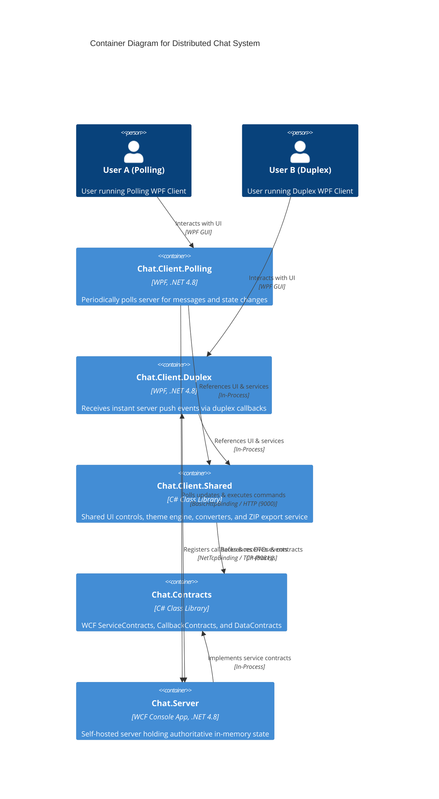

# Distributed Real-Time Chat Application

> An educational distributed chat application built with **C#**, **.NET Framework 4.8**, **WCF**, and **WPF**, exploring client-server architecture, HTTP polling, and NetTcp duplex push communication.

---

## 📌 Context & Disclaimer

Independent educational project for self-directed learning on distributed systems, concurrent server state, and WCF communication patterns. Not an official university assessment submission. Educational reference material is located in `docs/`.

---

## 🏗 System Architecture

The application uses a multi-tier client-server architecture with shared contract definitions:



### 📐 C4 Model Diagrams (`.mmd`)

All raw C4 architecture diagram files are located in [`docs/architecture/c4/`](docs/architecture/c4/):

- **Level 1 (System Context)**: [`level-1-context.mmd`](docs/architecture/c4/level-1-context.mmd)
- **Level 2 (Containers)**: [`level-2-container.mmd`](docs/architecture/c4/level-2-container.mmd)
- **Level 3 (Components)**:
  - **Server**: [`level-3-component-server.mmd`](docs/architecture/c4/level-3-component-server.mmd)
  - **Polling Client**: [`level-3-component-polling-client.mmd`](docs/architecture/c4/level-3-component-polling-client.mmd)
  - **Duplex Client**: [`level-3-component-duplex-client.mmd`](docs/architecture/c4/level-3-component-duplex-client.mmd)
  - **Shared Client & Contracts**: [`level-3-component-shared.mmd`](docs/architecture/c4/level-3-component-shared.mmd)
- **Level 4 (Code / Class Diagram)**: [`level-4-code.mmd`](docs/architecture/c4/level-4-code.mmd)

### Protocols & Endpoints

| Client | Contract | Binding | Default Endpoint | Update Mechanism |
| :--- | :--- | :--- | :--- | :--- |
| **Polling Client** | `IChatService` | `BasicHttpBinding` | `http://localhost:9000/ChatService/Polling` | Periodic request-response polling |
| **Duplex Client** | `IDuplexChatService` | `NetTcpBinding` | `net.tcp://localhost:8081/ChatService/Duplex` | Real-time push via `IChatCallback` |

---

## 📊 Feature & Requirement Matrix

### Section A: Client Functionality (14 Marks)

| # | Feature | Marks | Status | Summary | Locations |
|---|:---|:---:|:---:|---|---|
| **A.1** | **Sign in** | 2m | ✅ Complete | Passwordless sign-in by user ID; rejects duplicate active usernames with reason. | `SignInView.xaml.cs`<br>`UserManager.cs` |
| **A.2** | **Channel list** | 2m | ✅ Complete | Auto-updating channel list. Single channel membership per user with return on leave. | `ChannelListView.xaml.cs`<br>`ChannelManager.cs` |
| **A.3** | **Channel creation** | 2m | ✅ Complete | Creates named channels; rejects duplicate channel names with feedback. | `ChannelListView.xaml.cs`<br>`ChannelManager.cs` |
| **A.4** | **Channel conversation** | 2m | ✅ Complete | Public channel messaging and live member list. Late joiners only receive new messages. | `ConversationView.xaml.cs`<br>`MessageRouter.cs` |
| **A.5** | **Private conversation** | 2m | ✅ Complete | 1-on-1 private messaging in dedicated popup windows with concurrent window support. | `PrivateMessageView.xaml.cs`<br>`MessageRouter.cs` |
| **A.6** | **File sharing** | 3m | ✅ Complete | Upload/download image and text files (max 2 MB) with in-app click-to-open. | `ConversationView.xaml.cs`<br>`FileHandler.cs` |
| **A.7** | **Sign out** | 1m | ✅ Complete | Clean channel exit, session release, and shutdown from any view. | `MainWindow.xaml.cs`<br>`ChatService.cs` |

---

### Section B: Server Functionality (10 Marks)

| # | Feature | Marks | Status | Summary | Locations |
|---|:---|:---:|:---:|---|---|
| **B.1** | **User management** | 2m | ✅ Complete | Authoritative unique session tracking; immediate ID release on disconnect. | `UserManager.cs` |
| **B.2** | **Channel management** | 2m | ✅ Complete | Authoritative unique channel registry and single-channel-per-user enforcement. | `ChannelManager.cs` |
| **B.3** | **Message distribution** | 2m | ✅ Complete | Dispatches public messages strictly to active channel members without replay. | `MessageRouter.cs` |
| **B.4** | **Private messaging** | 2m | ✅ Complete | Delivers private messages strictly between co-channel members; rejects others. | `MessageRouter.cs` |
| **B.5** | **File handling** | 2m | ✅ Complete | In-memory file storage enforcing allowed formats and 2 MB limit for channel members. | `FileHandler.cs` |

---

### Section C: Duplex Client (8 Marks)

| # | Feature | Marks | Status | Summary | Locations |
|---|:---|:---:|:---:|---|---|
| **C.1** | **Duplex contract & callbacks** | 2m | ✅ Complete | `IDuplexChatService` and `IChatCallback` over NetTcpBinding with session mapping. | `IDuplexChatService.cs`<br>`CallbackManager.cs` |
| **C.2** | **Pure push updates** | 2m | ✅ Complete | All core updates pushed by server callbacks; no polling loops or refresh buttons. | `ChatCallbackHandler.cs`<br>`DuplexServiceClient.cs` |
| **C.3** | **Thread safety & UI marshaling** | 2m | ✅ Complete | Thread-safe server state; client marshals callback events onto WPF UI thread. | `ChannelManager.cs`<br>`ChatCallbackHandler.cs` |
| **C.4** | **Disconnection handling** | 2m | ✅ Complete | Detects client drops, frees user ID, removes from channel, and notifies peers. | `CallbackManager.cs`<br>`DuplexDisconnectCleanupIntegrationSuite.cs` |

---

### Additional / Enhancement Features

| Feature | Category | Status | Summary | Locations |
|---|:---|:---:|---|---|
| **Chat Export (.ZIP)** | Export / UX | ✅ Complete | Exports conversation transcript (`transcript.txt`) and media files to `.zip`. | `ChatExportService.cs` |
| **Dynamic Endpoint Settings** | Configuration | ✅ Complete | Runtime UI dialog to update server URLs without app restart. | `EndpointSettingsDialog.xaml`<br>`ConfigurationService.cs` |
| **Theme Switching** | UI / Styling | ✅ Complete | Runtime toggle between Dark and Light mode themes. | `ThemeService.cs`<br>`Styles/` |
| **Custom Window Chrome** | UI / Windows | ✅ Complete | Frameless window with custom title bar and 8-direction mouse resizing. | `CustomTitleBar.xaml`<br>`WindowResizer.cs` |
| **Procedural Ribbon Avatars** | UI / Avatars | ✅ Complete | Deterministic SVG ribbon avatar generation from username hash. | `StringToRibbonPathConverter.cs` |
| **Message Grouping** | UI / Chat | ✅ Complete | Groups consecutive messages from the same sender to reduce header clutter. | `MessageViewModel.cs` |
| **Bounded Message Queue** | Server / Perf | ✅ Complete | Configurable message buffer (`--max-messages`) with eviction logging. | `ChannelManager.cs` |
| **Color Console Logging** | Server / Logs | ✅ Complete | Tagged, timestamped, color-coded server activity and error logging. | `ServerLogger.cs` |
| **Structured Test Suite & CI** | Testing / QA | ✅ Complete | 3 unit test suites, 5 integration suites, and automated PowerShell CI runner. | `Chat.Server.Tests/`<br>`run-integration-tests.ps1` |
| **UI Converters & Attached Props** | UI / Helpers | ✅ Complete | File size formatters, initials converters, and rounded corner attached properties. | `Converters/`<br>`ControlHelper.cs` |

---

## 📂 Project Structure

```text
COMP3008/
├── COMP3008.slnx                 # Solution file (with .slnf filters)
├── src/
│   ├── Chat.Contracts/           # WCF service, callback, and data contracts
│   ├── Chat.Server/              # Self-hosted WCF server & state management
│   ├── Chat.Client.Shared/       # Shared UI components, themes, converters & export service
│   ├── Chat.Client.Polling/      # WPF client using periodic HTTP polling
│   └── Chat.Client.Duplex/       # WPF client using real-time NetTcp duplex callbacks
├── tests/
│   └── Chat.Server.Tests/        # Unit and integration test suites
├── scripts/                      # Convenience launchers (.ps1 / .bat) & CI test runner
└── docs/                         # Assignment specs, lab guides, and C4 architecture diagrams (.mmd)
    └── architecture/
        └── c4/                   # Raw .mmd C4 diagrams (Levels 1 to 4)
```

---

## 🔒 Constraints & Rules

- **State**: Authoritative in-memory server state (no database). Server restart resets all state.
- **Message Isolation**: Messages are not back-filled to late joiners; only new messages are visible.
- **Private Chat**: Restricted strictly to members currently within the same channel.
- **File Restrictions**: Allowed formats: `.png`, `.jpg`, `.jpeg`, `.gif`, `.bmp`, `.txt` (Max size: **2 MB**).

---

## 🚀 Build & Run

### Prerequisites
- Windows 10 / 11
- .NET Framework 4.8 SDK / Developer Pack
- Visual Studio 2019/2022 or MSBuild / `dotnet` CLI

### Building
```powershell
# Build using dotnet CLI
dotnet build COMP3008.slnx -c Debug

# Or build using MSBuild
msbuild COMP3008.slnx /p:Configuration=Release
```

### Running
```powershell
# Start Server
.\scripts\run_server_debug.ps1
# (or with arguments: .\src\Chat.Server\bin\Debug\Chat.Server.exe --max-messages 100)

# Start Polling Client
.\scripts\run_client_polling_debug.ps1

# Start Duplex Client
.\scripts\run_client_duplex_debug.ps1
```

---

## 🧪 Testing

```powershell
# Run automated CI test suite (launches server, runs all unit & integration tests)
powershell -ExecutionPolicy Bypass -File .\scripts\ci\run-integration-tests.ps1
```

---

## 📄 License

Distributed under the [Personal Educational Project License](LICENSE).
